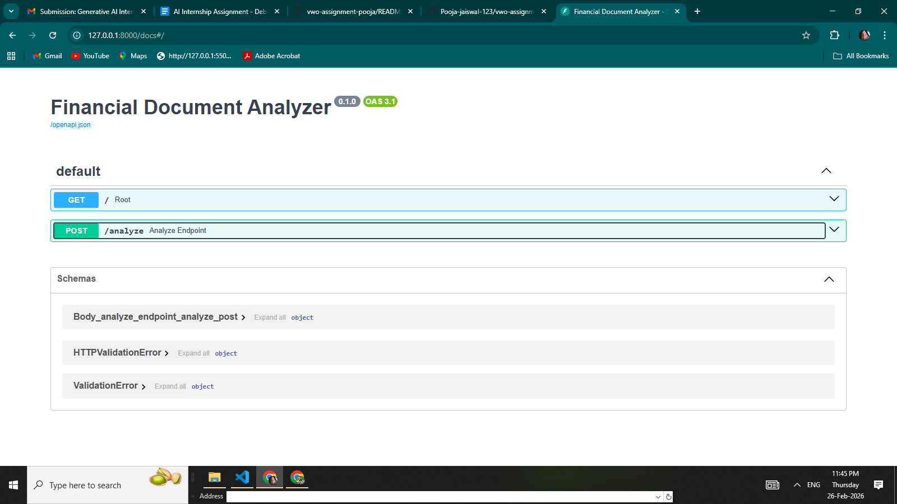
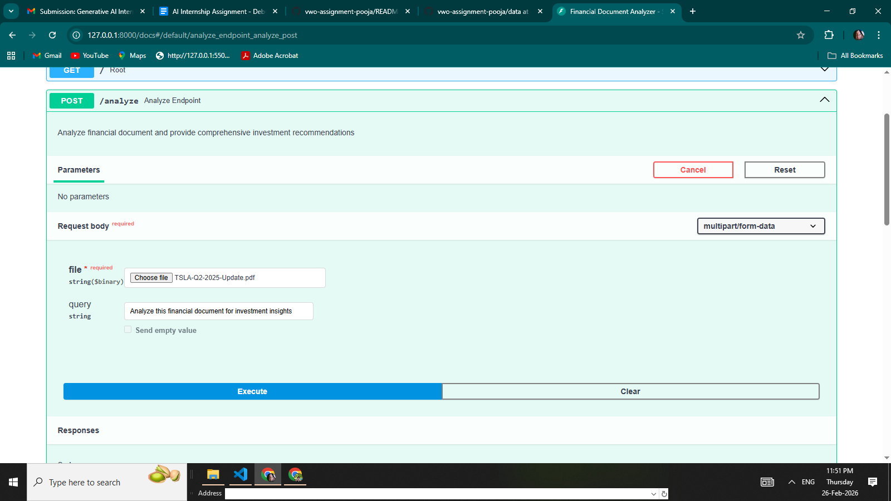
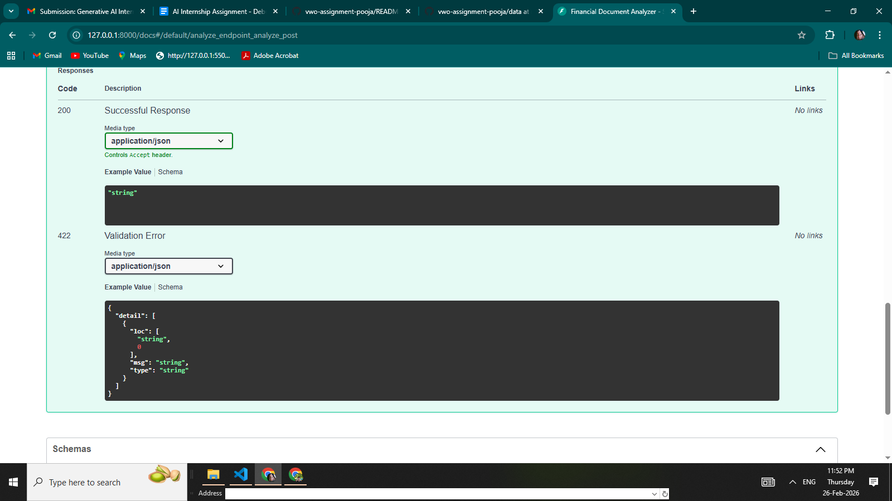

<div align="center">
  
  # 📊 Financial Document Analyzer (CrewAI) 
  ### *Debug Challenge - VWO Generative AI Internship*


  <br>
  
  *A robust, multi-agent financial document analysis system that processes corporate reports, extracts factual data, and generates compliant investment insights.*
  
</div>

---

## 📸 Project Showcase

> Below are the visual proofs of the fixed system running successfully on the local environment.

### 1. Interactive API Interface (FastAPI Swagger UI)

The successfully initialized FastAPI server with the `/analyze` endpoint ready for requests.


### 2. Document Upload & Execution

Demonstrates the process of uploading the Tesla Q2 2025 financial document and sending a custom analysis query.


### 3. API Response & Successful Execution

Confirms a `200 Successful Response`, indicating that the CrewAI agents have finished processing the document and returned the final analysis.


---

## ✨ Expected Features (Now Fully Working)

| Feature                        | Status | Description                                                              |
| :----------------------------- | :----: | :----------------------------------------------------------------------- |
| **Document Upload**            |   ✅   | Seamlessly upload financial documents (PDF format) via FastAPI.          |
| **Deterministic AI Analysis**  |   ✅   | Fact-based data extraction using specialized CrewAI agents.              |
| **Investment Recommendations** |   ✅   | Compliant, non-speculative advice based purely on verified data.         |
| **Risk Assessment**            |   ✅   | Factual identification of market and operational risks.                  |
| **Database Persistence**       |   ✅   | Local SQLite database integration to store queries and analysis results. |

---

## 🚀 Getting Started

### 1. Prerequisites & Installation

Ensure you have Python 3.10+ installed. Clone the repository and install the required dependencies:

```sh
# Clone the repository
git clone [https://github.com/Pooja-jaiswal-123/vwo-assignment-pooja.git](https://github.com/Pooja-jaiswal-123/vwo-assignment-pooja.git)

# Navigate to the project directory
cd vwo-assignment-pooja

# Install dependencies
pip install -r requirements.txt
```
